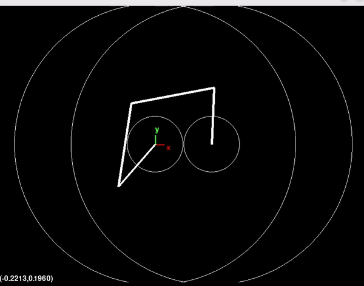

# Parallel robot simulation
Simulation of a parallel robot. The simulation solves the forward and inverse kinematics of the robot. The robot listens to commands and reports its state via the telemetry.
## Example
Drawing an image from a CSV coordinates file.
